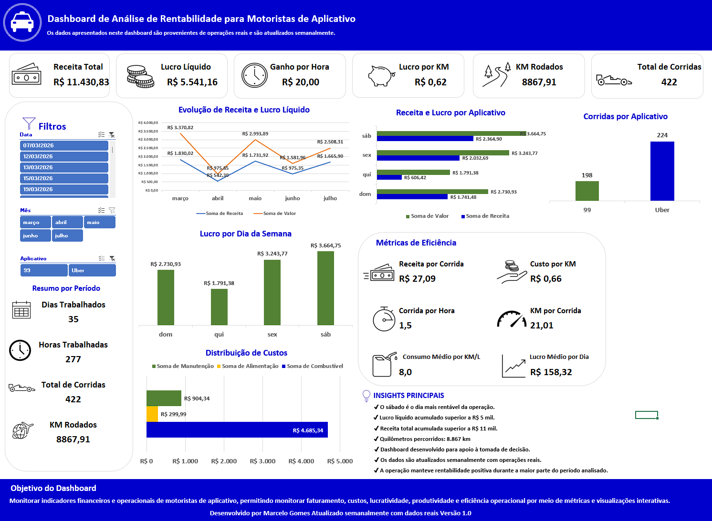
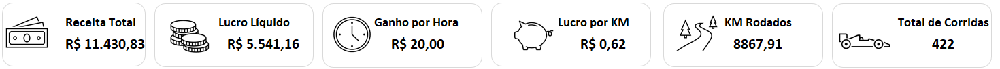
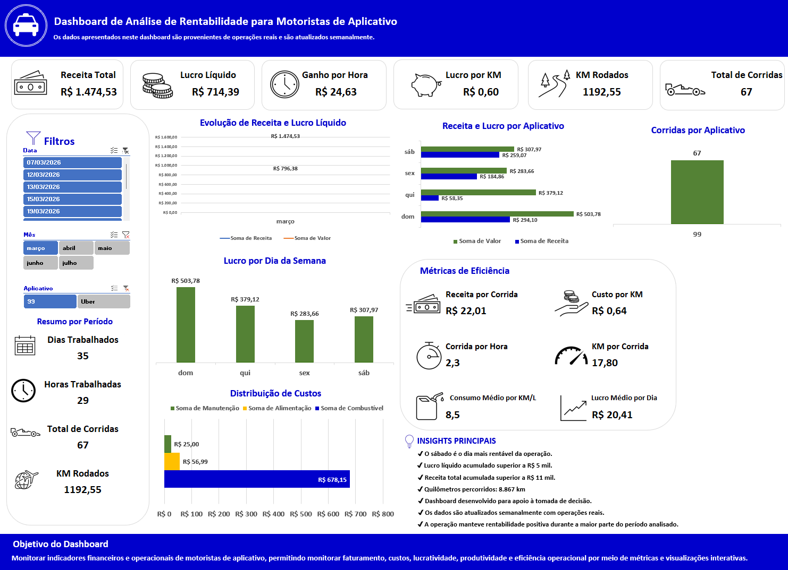
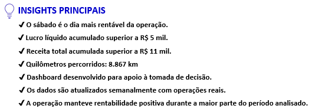
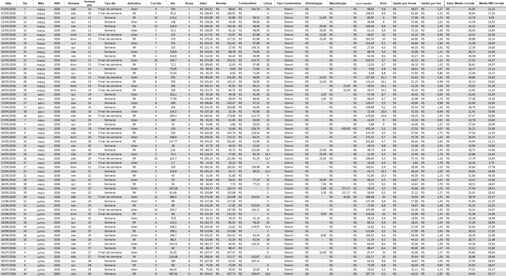
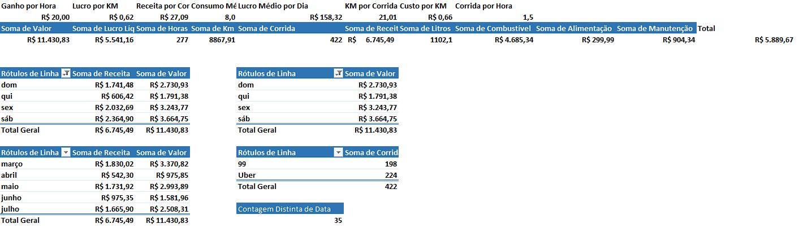

# 📊 Dashboard de Análise de Rentabilidade para Motoristas de Aplicativo

Projeto desenvolvido em **Microsoft Excel** para analisar a rentabilidade de motoristas de aplicativo por meio de indicadores financeiros e operacionais.

> **Este projeto utiliza dados reais coletados durante operações como motorista de aplicativo.**
>
> O dashboard é atualizado semanalmente, permitindo acompanhar a evolução da receita, custos, lucro e produtividade por meio de indicadores e visualizações interativas.

---

# 📌 Objetivo

Desenvolver um dashboard interativo capaz de transformar dados operacionais em informações estratégicas, auxiliando na tomada de decisão através de indicadores financeiros, gráficos e análises visuais.

---

# 🚀 Funcionalidades

- 📊 Dashboard interativo
- 📅 Filtros por período
- 🚗 Filtros por aplicativo
- 💰 Indicadores financeiros (KPIs)
- 📈 Evolução da receita
- 📉 Evolução do lucro
- 💸 Distribuição dos custos
- 📋 Métricas de produtividade
- 💡 Insights estratégicos
- 📊 Atualização contínua com dados reais

---

# 📈 Indicadores Monitorados

- Receita Total
- Lucro Líquido
- Ganho por Hora
- Lucro por Quilômetro
- Quilômetros Rodados
- Total de Corridas
- Receita Média por Corrida
- Corridas por Hora
- Custo por Quilômetro
- Consumo Médio
- Lucro Médio por Dia

---

# 🛠 Tecnologias Utilizadas

- Microsoft Excel
- Tabelas Dinâmicas
- Segmentações de Dados (Slicers)
- Gráficos Dinâmicos
- Fórmulas Avançadas
- Dashboard Interativo

---

# 📂 Estrutura do Projeto

O projeto foi organizado em quatro etapas principais.

## 📁 Registro

Base de dados contendo todas as corridas registradas com informações financeiras e operacionais.

---

## 📊 Tabela Dinâmica

Responsável pela consolidação e organização dos dados utilizados pelo dashboard.

---

## 📈 Métricas

Área destinada ao cálculo dos principais indicadores de desempenho.

---

## 📉 Dashboard

Painel interativo utilizado para análise financeira e operacional da atividade.

---

# 📷 Imagens

## Dashboard Principal

---

## Indicadores (KPIs)

---

## Dashboard com Filtros Aplicados

---

## Insights Principais

---

## Base de Dados

---

## Tabela Dinâmica

---

# 💡 Principais Insights

- ✅ Dados reais atualizados semanalmente.
- ✅ Monitoramento contínuo da rentabilidade da operação.
- ✅ Identificação dos períodos mais lucrativos.
- ✅ Acompanhamento da evolução da receita e do lucro líquido.
- ✅ Controle detalhado dos custos operacionais.
- ✅ Apoio à tomada de decisão baseada em dados.

---

# ▶️ Como Utilizar

1. Faça o download do arquivo **Dashboard_Rentabilidade_Motorista_Aplicativo.xlsx**.
2. Abra o arquivo no **Microsoft Excel**.
3. Utilize os filtros para selecionar o período ou aplicativo desejado.
4. Analise os indicadores, gráficos e insights apresentados no dashboard.
5. Adicione novas corridas na aba **Registro** para atualizar automaticamente todas as métricas e visualizações.

> **Observação:** Os dados utilizados neste projeto são provenientes de operações reais. Informações sensíveis foram removidas ou anonimizadas para preservar a privacidade.

---

# 🎯 Próximas Evoluções

Este projeto continuará evoluindo com novas versões utilizando outras tecnologias:

- 📊 Power BI
- 🐍 Python (Pandas)
- 🗄️ SQL
- 📈 Automação da atualização dos dados
- 📉 Novos indicadores e análises

---

# 👨‍💻 Autor

**Marcelo Gomes**

Estudante de **Análise e Desenvolvimento de Sistemas**, com foco em **Análise de Dados**, **Business Intelligence** e desenvolvimento de soluções para problemas reais.

### GitHub

https://github.com/marcelogomesdev

### LinkedIn

https://www.linkedin.com/in/marcelogomesdev/

---

⭐ Se este projeto foi útil ou interessante, deixe uma estrela no repositório!
